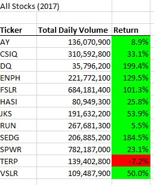
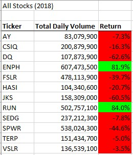

# Module 2: Stock Analysis

## Overview of Project

Steve wants to be able to quickly analyze a large number of stocks to see what the volume and trend of the stock is for multiple years. This way he can help guide his parents on which stocks to buy or sell. We want it to be automated so it can be done with the click of a button for multiple years.
Steve wanted to be able to click a button to run the program, he wanted to be able to input the year each time it ran so he could switch between years.
In the output he wanted it to have Total daily volume and Return rate for each stock price. he also wanted the return rate to be green if it was positive and red if it was negative.

### Purpose
The purpose of the The Challenge was to refactor code to remove loops in order to make the program run fast on a large number of stocks

## Results
### Analysis of Stocks
Below are the results for the stock performance for both 2017 and 2018

  

As you can see by the colors most of the stocks had better performance in 2017 while a lot had negative perfomance in 2018.

ENPH and RUN are the only two that had positive performance both years, and in 2018 they did very well.

### Analysis of Refactored run time

The original run time for the program is shown in screenshots below for each year. the program ran slower because it had two nested for loops for each row and column.

## Summary
