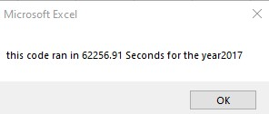
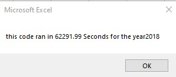
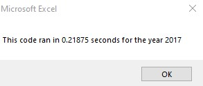
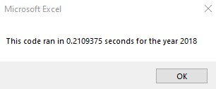

# Module 2: Stock Analysis

## Overview of Project

Steve wants to be able to quickly analyze many stocks to see what the volume and trend of the stock is for multiple years. This way he can help guide his parents on which stocks to buy or sell. We want it to be automated so it can be done with the click of a button for multiple years.
In the output he wanted it to have Total daily volume and Return rate for each stock price. he also wanted the return rate to be green if it was positive and red if it was negative.

### Purpose
The purpose of the Challenge was to refactor code to remove loops to make the program run fast on a large number of stocks

## Results
### Analysis of Stocks
Below are the results for the stock performance for both 2017 and 2018

  

As you can see by the colors most of the stocks had better performance in 2017 while a lot had negative performance in 2018.

ENPH and RUN are the only two that had positive performance both years, and in 2018 they did very well.

### Analysis of Refactored run time

The original run time for the program is shown in screenshots below for each year. the program ran slower because it had two nested for loops for each row and column.

 

When i refactored the code to only do one for loop and put data into arrays it ran much faster. The new run times are pictured below.

 

They only ran in a fraction of a minute after the refactoring.

## Summary

### What are the advantages or disadvantages of refactoring code?
Some of the advantages of refactoring code is that you already have a good start however if you make it run faster you can more easily scale your project to larger datasets. When you reduce inefficiencies, it will make it easier to work with in the future. The disadvantage of refactoring code is that you are not changing the outcome of the programming but spending more time on something that already works and you may introduce new bugs or errors.

### How do these pros and cons apply to refactoring the original VBA script?
Refactoring the code in this example was a great improvement to the time it takes to run. this can easily be scaled to a larger stock market dataset with no issues.
The cons don’t really apply as much to this project because I had ample amount of time to complete the refactor and it didn’t introduce any new bugs into the program. 

